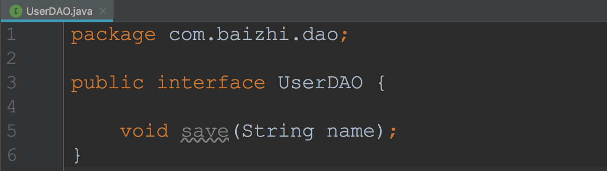
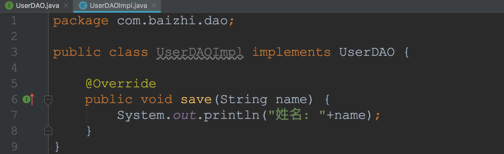
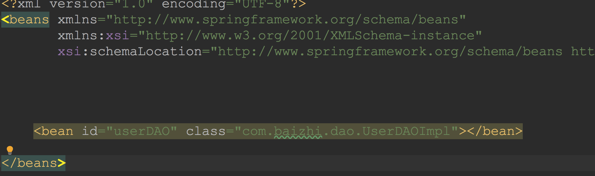
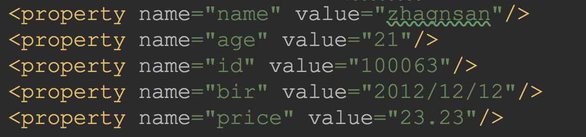
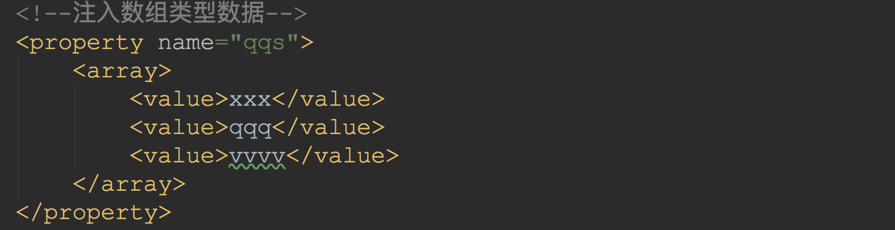
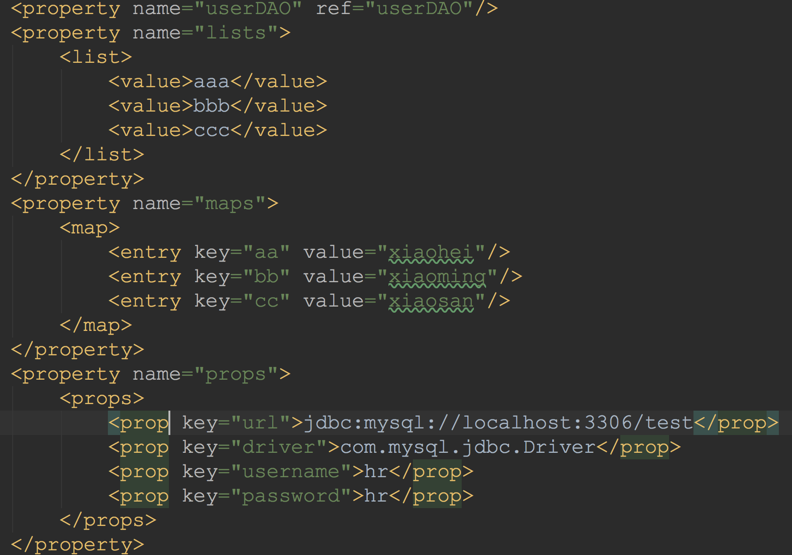

# Spring_day1

## 1. Spring框架的引言

`spring`(春天),生于在2002年,由`Rod Johnson`创作。Spring框架是一个集众多设计模式于一身的`开源的`、`轻量级`的`项目管理`框架。致力于JAVAEE轻量级解决方案。相对于原来学过的框架而言,spring框架和之前学习的struts2 、 mybatis 框架有了本质的区别,不是替换原来的某个框架,而是对其进行`整合管理`。

`轻量级解决方案`:提供一个以简单的、统一的、高效的方式构造整个应用，并且可以将单层框架以最佳的组合揉和在一起建立一个连贯的体系。

---

## 2.Spring框架的核心作用

Spring 框架用来`管理`**[创建|使用|销毁]**项目中的组件,由于spring 框架可以帮我们生产项目中组件对象,因此也习惯称spring是一个**工厂|容器**。

> **`组件`:** 项目中的service,dao,action,都是项目中的组件 
>
> **`注意`:** spring框架通常**不管理对实体类对象创建**

----

## 3.第一个环境搭建

> `a. 引入依赖`

```xml
	<dependency>
      <groupId>org.springframework</groupId>
      <artifactId>spring-core</artifactId>
      <version>4.3.2.RELEASE</version>
  </dependency>
  <dependency>
      <groupId>org.springframework</groupId>
      <artifactId>spring-beans</artifactId>
      <version>4.3.2.RELEASE</version>
  </dependency>
  <dependency>
      <groupId>org.springframework</groupId>
      <artifactId>spring-web</artifactId>
      <version>4.3.2.RELEASE</version>
  </dependency>
  <dependency>
      <groupId>org.springframework</groupId>
      <artifactId>spring-expression</artifactId>
      <version>4.3.2.RELEASE</version>
  </dependency>
  <dependency>
      <groupId>org.springframework</groupId>
      <artifactId>spring-aop</artifactId>
      <version>4.3.2.RELEASE</version>
  </dependency>
  <dependency>
      <groupId>org.springframework</groupId>
      <artifactId>spring-context</artifactId>
      <version>4.3.2.RELEASE</version>
  </dependency>
  <dependency>
      <groupId>org.springframework</groupId>
      <artifactId>spring-context-support</artifactId>
      <version>4.3.2.RELEASE</version>
  </dependency>
  <dependency>
      <groupId>org.springframework</groupId>
      <artifactId>spring-aspects</artifactId>
      <version>4.3.2.RELEASE</version>
  </dependency>
  <dependency>
      <groupId>org.springframework</groupId>
      <artifactId>spring-jdbc</artifactId>
      <version>4.3.2.RELEASE</version>
  </dependency>
```

> `b. 引入配置文件`

```markdown
# 配置文件名称: 任意名称 
# 配置文件位置: 项目中根下任意位置
# 配置文件的内容:
		<?xml version="1.0" encoding="UTF-8"?>
    <beans xmlns="http://www.springframework.org/schema/beans"
           xmlns:xsi="http://www.w3.org/2001/XMLSchema-instance"
           xsi:schemaLocation="http://www.springframework.org/schema/beans 
           http://www.springframework.org/schema/beans/spring-beans-3.2.xsd ">
    </beans>
```

> `c.创建组件`





> `d.工厂管理`

```xml
<?xml version="1.0" encoding="UTF-8"?>
<beans xmlns="http://www.springframework.org/schema/beans"
       xmlns:xsi="http://www.w3.org/2001/XMLSchema-instance"
       xsi:schemaLocation="http://www.springframework.org/schema/beans http://www.springframework.org/schema/beans/spring-beans.xsd">

  	<!--通过bean标签管理组件对象-->
    <bean id="userDAO" class="com.baizhi.dao.UserDAOImpl"></bean>

</beans>
```



> `e.启动工厂`测试

```java
 public static void main(String[] args) {
			 //启动工厂
        ApplicationContext context = new ClassPathXmlApplicationContext("spring.xml");
				//获取对象
        UserDAO userDAO = (UserDAO) context.getBean("userDAO");

        userDAO.save("小黑");
    }
```

-----

## 4.Spring框架中的核心思想

#### 4.1 IOC[控制反转]

- `IOC**(inversion of controll)控制反转`

  ```markdown
  # 1.定义
  	将对象的创建由原来(new)的方式转移到配置文件中,交给spring工厂来创建对象
  ```

- `DI(dependcy Injection)依赖注入 `

  ```markdown
  # 1.定义
  	Spring不仅要创建对象,还要建立类与类之间的关系,因此在控制反转的基础上又提出了依赖注入的概念。
  ```

当我们在一个组件A类中想调用另一个组件B时，平常我们会手动new，这个当然也可以，但是Spring的配置文件中本身就有这个B组件的bean，new显得多此一举。于是乎，我们就把这个B组件声明成一个A的属性变量，再为他添加一个public的set方法。在A的bean中添加properties，properties里面写明要给哪个属性赋哪个bean，就可以自动调用set了。

#### 4.2 AOP[面向切面编程]

**AOP**( Aspect Oriental Programing ) **面向切面的编程**

------

## 5. SET方式注入

注意，注入的时候，虽然我们在serviceimpl写的是注入dao，但是实际上我们要的是具体实现类daoimpl（多态嘛）。所以在xml配置文件中我们要写的也是daoimpl。

### 5.1 八种基本类型+String类型 +日期类型的注入

```xml
<property name="name" value="zhagnsan"/>
<property name="age" value="21"/>
<property name="id" value="100063"/>
<property name="bir" value="2012/12/12"/>
<property name="price" value="23.23"/>
```




> `数组类型注入`

```xml
<!--注入数组类型数据-->
  <property name="qqs">
     <array>
         <value>xxx</value>
         <value>qqq</value>
         <value>vvvv</value>
      </array>
  </property>
```




> `注入引用类型和集合类型`

```xml
<!--注入引用类型和对象-->
<property name="userDAO" ref="userDAO"/>
<property name="lists">
  <list>
    <value>aaa</value>
    <value>bbb</value>
    <value>ccc</value>
  </list>
</property>
<property name="maps">
  <map>
    <entry key="aa" value="xiaohei"/>
    <entry key="bb" value="xiaoming"/>
    <entry key="cc" value="xiaosan"/>
  </map>
</property>
<property name="props">
  <props>
    <prop key="url">jdbc:mysql://localhost:3306/test</prop>
    <prop key="driver">com.mysql.jdbc.Driver</prop>
    <prop key="username">hr</prop>
    <prop key="password">hr</prop>
  </props>
</property>
```




> `**注意**: 引用类型使用ref属性注入,基本类型使用value属性注入`

----

## 6.构造注入

```xml
	<constructor-arg index="0" name="id" value="1"/>
	<constructor-arg index="1" name="name" value="xiaohei"/>
	<constructor-arg index="2" name="age" value="12"/>
	<constructor-arg index="3" name="qqs">
    <array>
      <value>xxx</value>
      <value>222</value>
      <value>333</value>
    </array>
	</constructor-arg>
```

> `注意:构造注入并不常用,不过在一些框架类中必须使用构造注入,这里先了解其注入语法即可。`

## 7.自动注入


> - **autowire=”byName”**
>
> > `根据注入的属性名与配置文件中bean的id匹配,一致则注入,不一致报错`
>
> - **autowire=”byType”**
>
> > `根据注入的属性类型,与配置文件中的类型匹配,类型一致注入(在多个实现类时,会产生歧义)`
>
> `注意: 无论使用以上那种方式注入都需要为属性提供set方法`

----

## 8.bean的创建模式

**singleton:单例 默认**

​	 	 在工厂中`全局唯一,只创建一次`

**prototype: 多例** 

​		 `全局不唯一,每次使用都会创建一个新的对象`

```java
<bean id="" class="xxxx.userAction" scope="prototype|singleton">
		service,dao    ----->  singleton
		struts2 action -----> prototype
```

> `注意:在项目开发中service,dao组件单例,struts2的Action必须为:多例`

-----

## 9.bean的生产原理

> `原理`:   `反射+构造方法`

```java
 UserDAOImpl userDAO = (UserDAOImpl) Class.forName("com.baizhi.dao.UserDAOImpl").newInstance();
 System.out.println(userDAO);
```

----

## 10.bean的生命周期

> - `何时创建`
>
>   随着工厂启动, **`所有单例bean随之创建 非单例的bean,每次使用时创建`**
>
> - `何时销毁`
>
>   工厂**`关闭,所有bean随之销毁`** (  注意:  `spring对多例bean管理松散,不会负责多例bean的销毁`)

## 11.bean工厂创建对象的好处

> 1. `使用配置文件管理java类,再生产环境中更换类的实现时不需要重新部署,修改文件即可`
>2. `spring默认使用单例的模式创建bean,减少内存的占用`
> 3. `通过依赖注入建立了类与类之间的关系(使java之间关系更为清晰,方便了维护与管理)`

- 作业
  - SET注入2遍
  - 构造自动 注入 以及工厂特性  上课案例自己至少过一遍