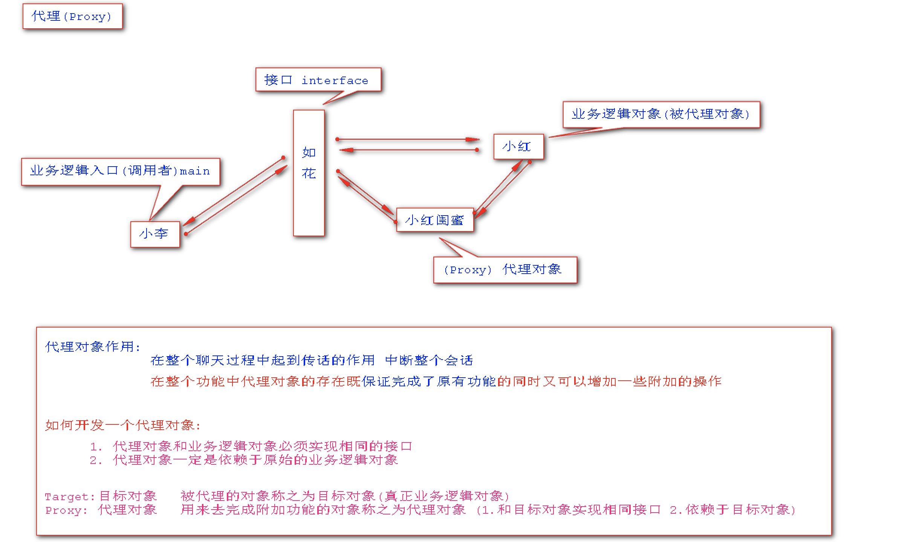
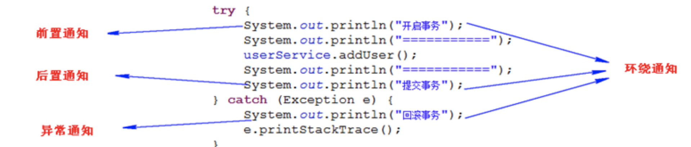
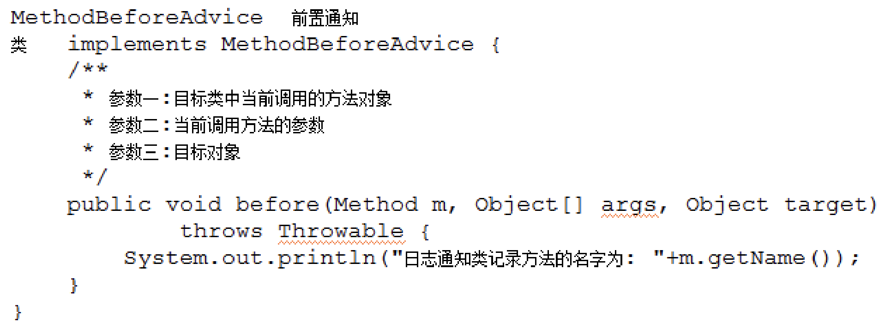
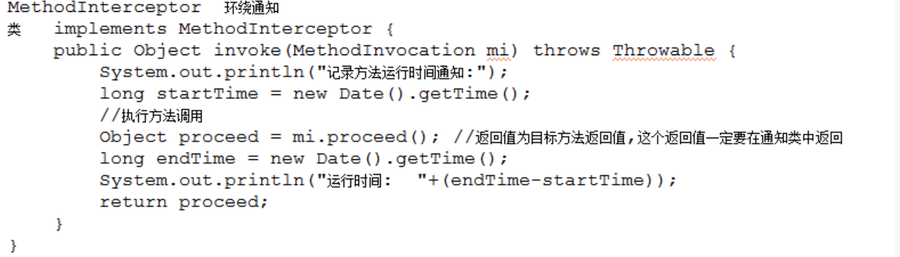
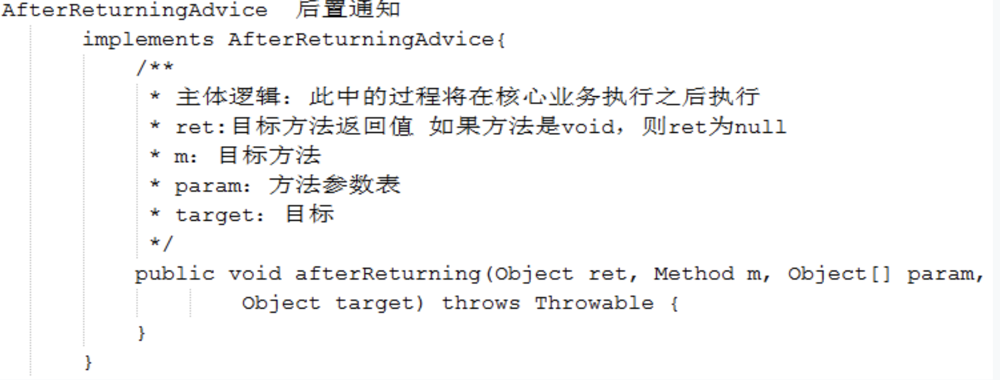
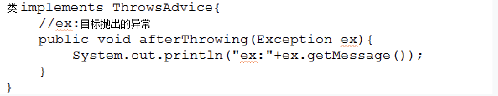
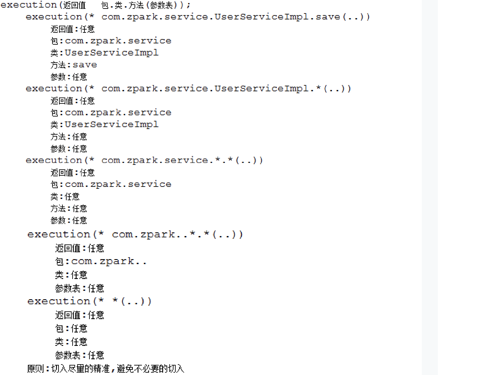

# Spring_day2

## 1.现有业务层开发存在问题

### a.定义业务接口

```java
public interface UserService {
    void save(String name);
    void delete(String id);
    void update();
    String findAll(String name);
    String findOne(String id);
}
```

### b.实现业务接口

```java
public class UserServiceImpl implements UserService {
    @Override
    public void save(String name) {
        try {
            System.out.println("开启事务");
            System.out.println("处理业务逻辑,调用DAO~~~");
            System.out.println("提交事务");
        }catch (Exception e){
            System.out.println("回滚事务");
            e.printStackTrace();
        }
    }

    @Override
    public void delete(String id) {
        try {
            System.out.println("开启事务");
            System.out.println("处理业务逻辑,调用DAO~~~");
            System.out.println("提交事务");
        }catch (Exception e){
            System.out.println("回滚事务");
            e.printStackTrace();
        }
    }

    @Override
    public void update() {
        try {
            System.out.println("开启事务");
            System.out.println("处理业务逻辑,调用DAO~~~");
            System.out.println("提交事务");
        }catch (Exception e){
            System.out.println("回滚事务");
            e.printStackTrace();
        }
    }

    @Override
    public String findAll(String name) {
        try {
            System.out.println("开启事务");
            System.out.println("处理业务逻辑,调用DAO~~~");
            System.out.println("提交事务");
        }catch (Exception e){
            System.out.println("回滚事务");
            e.printStackTrace();
        }
        return name;
    }

    @Override
    public String findOne(String id) {
        try {
            System.out.println("开启事务");
            System.out.println("处理业务逻辑,调用DAO~~~");
            System.out.println("提交事务");
        }catch (Exception e){
            System.out.println("回滚事务");
            e.printStackTrace();
        }
        return id;
    }
}
```

> 问题:从上图中可以看出,现有业务层中`控制事务代码出现了大量的冗余`,如何解决现有业务层出现的冗余问题?

----

## 2.代理引言

### a.什么是代理

> `代理`: 指的是java中的一种`设计模式`

### b.为什么需要代理

> `很多时候除了当前类能够提供的功能外，我们还需要补充一些额外功能。`

### c.代理的作用

> 代理对象可以在客户和目标对象之间`起到中介作用,从而为目标对象增添额外的功能`。

### d.代理图例



----

## 3.静态代理的开发

> `目标类|对象(target)`:被代理类称之为目标类|或者被代理的对象的称之为目标对象
> 		`开发代理的原则: 代理类和目标类功能一致且实现相同的接口,同时代理类中依赖于目标类对象`

### a.开发静态代理类

```java
//静态代理类
//开发原则:代理类和目标类实现相同接口,依赖于真正的目标类
public class UserServiceStaticProxy implements UserService {

    //真正的目标类 //target 原始业务逻辑对象
    private UserService userService;
    public void setUserService(UserService userService) {
        this.userService = userService;
    }

    @Override
    public void save(String name) {
        try {
            System.out.println("开启事务");
            userService.save(name);//调用真正业务逻辑方法
            System.out.println("提交事务");
        }catch (Exception e){
            System.out.println("回滚事务");
            e.printStackTrace();
        }
    }

    @Override
    public void delete(String id) {
        try {
            System.out.println("开启事务");
            userService.delete(id);//调用真正业务逻辑方法
            System.out.println("提交事务");
        }catch (Exception e){
            System.out.println("回滚事务");
            e.printStackTrace();
        }
    }

    @Override
    public void update() {
        try {
            System.out.println("开启事务");
            userService.update();//调用真正业务逻辑方法
            System.out.println("提交事务");
        }catch (Exception e){
            System.out.println("回滚事务");
            e.printStackTrace();
        }
    }

    @Override
    public String findAll(String name) {
        try {
            System.out.println("开启事务");
            String result = userService.findAll(name);//调用真正业务逻辑方法
            System.out.println("提交事务");
            return result;
        }catch (Exception e){
            System.out.println("回滚事务");
            e.printStackTrace();
        }
        return null;
    }

    @Override
    public String findOne(String id) {
        try {
            System.out.println("开启事务");
            //调用目标类方法
            String one = userService.findOne(id);//调用真正业务逻辑方法
            System.out.println("提交事务");
            return one;
        }catch (Exception e){
            System.out.println("回滚事务");
            e.printStackTrace();
        }
        return null;
    }
}
```

### b.更改目标实现类

```java
public class UserServiceImpl implements UserService {
    @Override
    public void save(String name) {
        System.out.println("处理业务逻辑,调用DAO~~~");
    }

    @Override
    public void delete(String id) {
        System.out.println("处理业务逻辑,调用DAO~~~");
    }

    @Override
    public void update() {
        System.out.println("处理业务逻辑,调用DAO~~~");
    }

    @Override
    public String findAll(String name) {
        System.out.println("处理业务逻辑,调用DAO~~~");
        return name;
    }

    @Override
    public String findOne(String id) {
        System.out.println("处理业务逻辑,调用DAO~~~");
        return id;
    }
}
```

### c.配置静态代理类

```xml
		<!--配置目标类-->
    <bean id="userService" class="staticproxy.UserServiceImpl"></bean>

    <!--配置代理类-->
    <bean id="userServiceStaticProxy" class="staticproxy.UserServiceStaticProxy">
        <!--注入目标对象-->
        <property name="userService" ref="userService"/>
    </bean>

```

### d.调用代理方法

```java
ApplicationContext context = new ClassPathXmlApplicationContext("spring.xml");
UserService userServiceStaticProxy = (UserService) context.getBean("userServiceStaticProxy");
userServiceStaticProxy.save("小黑");
```

> 新的问题:`往往在开发我们书写的不仅仅是一个业务层,两个业务层,而我们的业务层会有很多,如果为每一个业务层开发一个静态代理类,不仅没有减轻工作量,甚至让我们的工作量多了一倍不止怎么解决以上这个问题呢?`
>
> 解决方案: `为业务层在运行过程中动态创建代理类,通过动态代理类去解决我们现有业务层中业务代码冗余的问题` .

----

## 4.动态代理的原理

> `通过jdk提供的Proxy这个类,动态为现有的业务生成代理类`
> 	参数一:当前线程类加载器
> 	参数二:生成代理类的接口类型
> 	参数三:通过代理类对象调用方法时会优先进入参数三中的invoke方Proxy.newProxyInstance(loader, interfaces, h);//返回值就是动态代理对象

```java
public class TestDynamicProxy {
    public static void main(String[] args) {
        final UserService userService =  new UserServiceImpl();
        //参数1:当前线程类加载器
        ClassLoader contextClassLoader = Thread.currentThread().getContextClassLoader();
        //参数2:这个被代理类要实现的接口数组
        Class[] classes =  new Class[]{UserService.class};
        //参数3:
        UserService userServiceProxy = (UserService) Proxy.newProxyInstance(contextClassLoader, classes, new InvocationHandler() {
            @Override
            public Object invoke(Object proxy, Method method, Object[] args) throws Throwable {
                try{
                    System.out.println("开启事务");//附加操作
                    Object invoke = method.invoke(userService, args);
                    System.out.println("提交事务");//附加操作
                    return invoke;
                }catch (Exception e){
                    System.out.println("回滚事务");//附加操作
                }
                return null;
            }
        });
        userServiceProxy.save("小黑");
    }
}
```

https://blog.csdn.net/qq_28081081/article/details/80470958

这个举了个更加分离的动态代理的例子，他把InvocationHandler单独写了一个类（这是个接口）。在这个类里声明一个obj类型的成员变量，然后用obj.getClass().getInterfaces()作为要传入的参数。非常分离，十分容易理解的动态理念。

----

## 5.AOP (Aspect Oriented Programming)编程


> `通知(Advice)`: `除了目标方法以外的操作都称之为通知`
> 		`切入点(PointCut): 要为哪个类中的哪些方法加入通知`
> 		`切面(Aspect)`: `通知 + 切入点`

### 1.通知分类



### 2.编程步骤

```markdown
# 1.引入依赖
	 spring-aop
	 spring-expression
	 spring-aspects

# 2.开发通知类
	  MethodBeforeAdvice      前置通知
	  MethodInterceptor       环绕通知
	  AfterReturningAdvice    返回后通知
	  ThrowsAdvice						异常通知
	  
	  MyAdvice implements  通知接口{.....}
	  
    //自定义通知类:用来完成额外功能
    public class MyAdvice  implements MethodBeforeAdvice {
        @Override//参数1:当前调用的方法对象    //参数2:当前调用方法对象的参数  //参数3:目标对象
        public void before(Method method, Object[] objects, Object o) throws Throwable {
            System.out.println("目标方法名: "+method.getName());
            System.out.println("目标方法的参数: "+objects);
            System.out.println("目标对象: "+o.getClass());
        }
    }
# 3.配置切面
		a.引入aop命名空间
 			 <?xml version="1.0" encoding="UTF-8"?>
			 <beans xmlns="http://www.springframework.org/schema/beans"
       xmlns:xsi="http://www.w3.org/2001/XMLSchema-instance" 
       xmlns:aop="http://www.springframework.org/schema/aop"
       xsi:schemaLocation="http://www.springframework.org/schema/beans http://www.springframework.org/schema/beans/spring-beans.xsd 
       		                 http://www.springframework.org/schema/aop http://www.springframework.org/schema/aop/spring-aop.xsd">
		b.管理通知
			 <!--管理通知类-->
    	 <bean id="myAdvice" class="before.MyAdvice"/>
   	c.配置切面
   		<aop:config>
        <aop:pointcut id="pc" expression="execution(* before.UserServiceImpl.*(..))"/>
        <aop:advisor advice-ref="myAdvice" pointcut-ref="pc"/>
    	</aop:config>
    	//这里指定了要运行哪个类（被代理的）中的哪些方法。并在advisor里把pointcut和advice绑定。这样程序就知道该为哪个类做代理，该执行哪些方法，在这个方法前后都要执行哪些方法了。此时我们再从工厂中调用这个实现类，拿到的就是它的动态代理了。

# 4.启动工厂测试
		 		ClassPathXmlApplicationContext context = new ClassPathXmlApplicationContext("before/spring.xml");
        UserService userSerivce = (UserService) context.getBean("userService");
        System.out.println(userSerivce.getClass());
        userSerivce.save("小黑");
```

### 3.前置通知的使用



### 4.环绕通知的使用



### 5.返回后通知



### 6.异常通知



----

## 6.切入点表达表

### 1.execution方法级别的切入点表达式



> `注意:方法级别的切入点表达式尽可能精准,否则程序运行可能出现异常`

### 2.within类级别的切入点表达式

```markdown
# 1.语法
	within(包.类)

# 2.示例
	within(com.baizhi.service.*) 
			包: com.baizhi.service
			类: 所有类中所有方法不关心返回值和参数
	
	within(com.baizhi.service.UserServiceImpl)
			包: com.baizhi.service
			类: UserServiceImpl类中所有方法不关心返回值和参数
```

----

> `注意:within的效率高于execution表达式,推荐使用within表达式`

- 作业1: 四种通知+两种切入点表达式 练熟(项目建两个 至少写2遍以上)
- 作业2: 动态代理原理代码 写一写