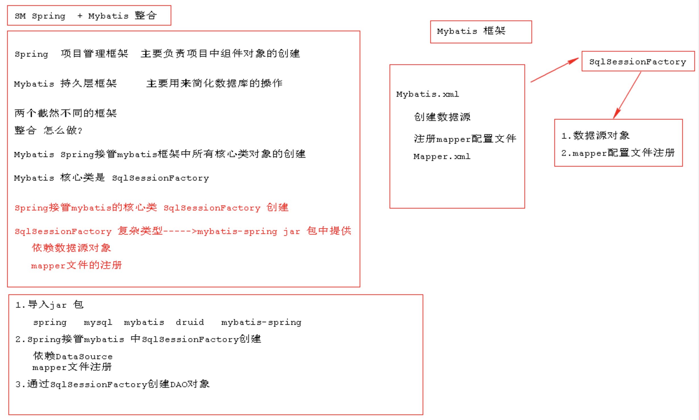
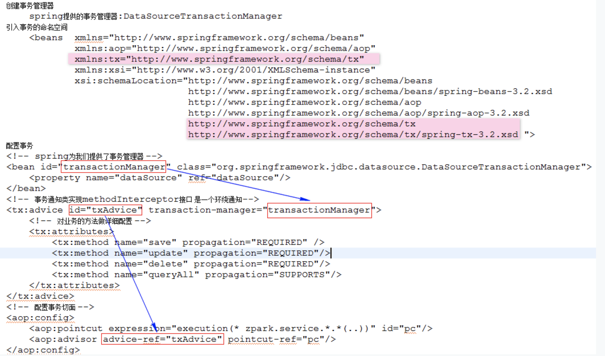

# Spring_day3

## 1.创建复杂对象

> `复杂对象`: 类中没有构造方法,或者构造方法不能调用如接口类型或抽象类实例

```java
//1.类 implements FactoryBean<创建的类型>

	public class ConnectionFactoryBean implements FactoryBean<Connection> {
    @Override
    public Connection getObject() throws Exception {
        Class.forName("com.mysql.jdbc.Driver");
        return DriverManager.getConnection("jdbc:mysql://localhost:3306/test","root","root");
    }

    @Override
    public Class<?> getObjectType() {
        return Connection.class;
    }

    @Override
    public boolean isSingleton() {
        return false;
    }
	}

// 2.配置工厂管理
	    <bean id="connectionFactoryBean" class="com.baizhi.factorybean.ConnectionFactoryBean"></bean>

// 3.获取复杂对象
		    ApplicationContext context = new ClassPathXmlApplicationContext("spring.xml");
        Connection conn = (Connection) context.getBean("connectionFactoryBean");
        System.out.println(conn);
```

----

## 2.SM整合思路

### 1.spring框架的作用

> `spring框架  项目管理框架  主要负责项目中组件对象的创建`

### 2.Mybatis框架的作用

> `Mybatis框架	   持久层框架        主要用来简化数据库访问的操作`

### 3.整合思路

> `整合思路: 两个框架作用不同,貌似没有什么联系,更深入看才能看出所谓Spring整合Mybatis,其实就是通过spring框架接管mybatis框架中核心对象的创建`

### 4.mybatis中的核心对象有哪些

> `Mybatis的核心对象为:  SqlSessionFactory`  整合就是通过Spring管理SqlSessionFactory对象的创建

### 5.整合思路图示



## 2.SM整合DAO编程步骤

### 1.引入mybatis的依赖jar包

```xml
<dependency>
  <groupId>org.mybatis</groupId>
  <artifactId>mybatis</artifactId>
  <version>3.2.8</version>
</dependency>
```

### 2.引入Spring相关jar包

```xml
<dependency>
  <groupId>org.springframework</groupId>
  <artifactId>spring-core</artifactId>
  <version>4.3.2.RELEASE</version>
</dependency>
<dependency>
  <groupId>org.springframework</groupId>
  <artifactId>spring-context</artifactId>
  <version>4.3.2.RELEASE</version>
</dependency>
<dependency>
  <groupId>org.springframework</groupId>
  <artifactId>spring-context-support</artifactId>
  <version>4.3.2.RELEASE</version>
</dependency>
<dependency>
    <groupId>org.springframework</groupId>
    <artifactId>spring-jdbc</artifactId>
    <version>4.3.2.RELEASE</version>
  </dependency>
<dependency>
  <groupId>org.springframework</groupId>
  <artifactId>spring-aop</artifactId>
  <version>4.3.2.RELEASE</version>
</dependency>
<dependency>
  <groupId>org.springframework</groupId>
  <artifactId>spring-beans</artifactId>
  <version>4.3.2.RELEASE</version>
</dependency>
<dependency>
  <groupId>org.springframework</groupId>
  <artifactId>spring-expression</artifactId>
  <version>4.3.2.RELEASE</version>
</dependency>
<dependency>
  <groupId>org.springframework</groupId>
  <artifactId>spring-aspects</artifactId>
  <version>4.3.2.RELEASE</version>
</dependency>
<dependency>
  <groupId>org.springframework</groupId>
  <artifactId>spring-tx</artifactId>
  <version>4.3.2.RELEASE</version>
</dependency>
<dependency>
  <groupId>org.springframework</groupId>
  <artifactId>spring-web</artifactId>
  <version>4.3.2.RELEASE</version>
</dependency>
```

### 3.mybatis-spring整合jar

```xml
<dependency>
  <groupId>org.mybatis</groupId>
  <artifactId>mybatis-spring</artifactId>
  <version>1.3.1</version>
</dependency>
```

### 4.引入数据库驱动jar

```xml
<dependency>
  <groupId>mysql</groupId>
  <artifactId>mysql-connector-java</artifactId>
  <version>5.1.40</version>
</dependency>
<dependency>
    <groupId>com.alibaba</groupId>
    <artifactId>druid</artifactId>
    <version>1.1.12</version>
</dependency>
```

### 5.建表

```sql
CREATE TABLE `t_user` (
  `id` varchar(40) NOT NULL,
  `name` varchar(40) DEFAULT NULL,
  `age` int(3) DEFAULT NULL,
  `bir` timestamp NULL DEFAULT NULL,
  PRIMARY KEY (`id`)
) ENGINE=InnoDB DEFAULT CHARSET=utf8;
```

### 6.编写实体类

```java
public class User {
    private String id;
    private String name;
    private Integer age;
    private Date bir;
		//......
}
```

### 7.书写DAO接口

```java
public interface UserDAO {
    //查询所有
    List<User> findAll();
}
```

### 8.编写mapper配置文件

```xml
<!DOCTYPE mapper PUBLIC "-//mybatis.org//DTD Mapper 3.0//EN" "http://mybatis.org/dtd/mybatis-3-mapper.dtd">
<mapper namespace="com.baizhi.dao.UserDAO">
    
    <select id="findAll" resultType="com.baizhi.entity.User">
        select id,name,age,bir from t_user
    </select>

</mapper>
```

### 9.编写Spring-myabtis整合配置文件

```xml
		<!--创建数据源-->
    <bean id="dataSource" class="com.alibaba.druid.pool.DruidDataSource">
        <property name="driverClassName" value="com.mysql.jdbc.Driver"/>
        <property name="url" value="jdbc:mysql://localhost:3306/sm"/>
        <property name="username" value="root"/>
        <property name="password" value="root"/>
    </bean>

    <!--创建sqlSessionFactory-->
    <bean id="sqlSessionFactory" class="org.mybatis.spring.SqlSessionFactoryBean">
        <property name="dataSource" ref="dataSource"/>
        <property name="mapperLocations" >
            <array>
                <value>classpath:com/baizhi/mapper/UserDAOMapper.xml</value>
            </array>
        </property>
    </bean>

    <!--创建DAO-->
    <bean id="userDAO" class="org.mybatis.spring.mapper.MapperFactoryBean">
        <property name="sqlSessionFactory" ref="sqlSessionFactory"/>
        <property name="mapperInterface" value="com.baizhi.dao.UserDAO"/>
    </bean>
```

### 10.启动工厂测试

```java
ClassPathXmlApplicationContext context = new ClassPathXmlApplicationContext("spring.xml");
UserDAO userDAO = (UserDAO) context.getBean("userDAO");
List<User> users = userDAO.findAll();
for (User user : users) {
  System.out.println(user);
}
```

-----

## 3.SM整合Service编程步骤

### 1.编写spring-mybatis.xml配置文件

```xml
<!--创建事务管理器-->
    <bean id="transactionManager" class="org.springframework.jdbc.datasource.DataSourceTransactionManager">
        <property name="dataSource" ref="dataSource"/>
    </bean>

    <!--配置事务属性-->
    <tx:advice id="txAdvice" transaction-manager="transactionManager">
        <tx:attributes>
            <tx:method name="save*"/>
            <tx:method name="update*"/>
            <tx:method name="delete*"/>
            <tx:method name="find*"/>
        </tx:attributes>
    </tx:advice>

    <!--配置事务切面-->
    <aop:config>
        <aop:pointcut id="pc" expression="within(com.baizhi.service.*)"/>
        <aop:advisor advice-ref="txAdvice" pointcut-ref="pc"/>
    </aop:config>
```

### 2.配置图示

这里说一下事务管理器的事。因为数据库的连接池里面有很多个conn，那么一个thread在执行多个sql语句的时候，拿到的是同一个conn吗？这个很重要，因为如果我们要执行一个事务，事务出了问题要回滚。如果不是同一个，那么很难保证事务的一致性和原子性。



### 3.创建service接口

```java
public interface UserService {
    List<User> findAll();
}
```

### 4.创建service对象

```java
public class UserServiceImpl implements UserService {
    
    private UserDAO userDAO;
    public void setUserDAO(UserDAO userDAO) {
        this.userDAO = userDAO;
    }

    @Override
    public List<User> findAll() {
        return userDAO.findAll();
    }
}
```

### 5.配置业务组件对象

```xml
  <!--配置Service组件-->
    <bean id="userService" class="com.baizhi.service.UserServiceImpl">
        <property name="userDAO" ref="userDAO"/>
    </bean>
```

### 6.启动测试

-----


## 4.事务属性

### 1.事务传播属性

```markdown
# propagation: 传播
		
		REQUIRED:   需要事务,外部存在事务融入当前事务,外部没有事务,开启新的事务
		SUPPORTS:   支持事务,外部存在事务融入当前事务,外部没有事务,不开启新的事务
		REQUIRES_NEW: 每次开启新的事务,如果外部存在事务外部事务挂起,开启新的事务运行,运行结束后回复外部事务
		NOT_SUPPORTED: 不支持事务,如果外部存在事务外部事务挂起,已非事务方式运行.
		NEVER:				 不支持事务,存在事务报错
		MANDATORY:		 强制事务没有事务报错
		NESTED:				 嵌套事务,数据库不支持
```

### 2.事务的隔离级别

```markdown
# isolation 隔离级别
	
	DEFAULT: 采用数据库默认隔离级别
	READ_UNCOMMITTED: 读未提交 
	READ_COMMITTED: 读提交 用来避免脏读现象出现的   oracle默认隔离级别
	REPEATABLE_READ: 可重复读主要是用来避免不可重复读现象出现的 (在一次事务中一方更新,导致两次查询结果不一致这种情况叫不可重复读)  mysql默认隔离级别
	SERIALIZABLE   : 序列化读 用来避免幻影读现象出现          (在一次事务中一方插入,导致两次查询结果不一致这种情况叫幻影读)
	
```

### 3.读写和异常性

```markdown
# readonly 
   `true:    本次事务只读
   `false:   本次事务非只读
	<tx:method name="save*" propagation="REQUIRES_NEW" read-only="true|false" isolation="SERIALIZABLE"/>
	
# rollback-for && no-rollback-for=""
		rollback-for: 遇到什么类异常回滚
		no-rollback-for: 遇到什么类异常不回滚
   	<tx:method name="save*" rollback-for="" no-rollback-for="" propagation="REQUIRES_NEW" read-only="true" isolation="SERIALIZABLE"/>

# timeout 超时性
		timeout: -1 永不超时
```

----

